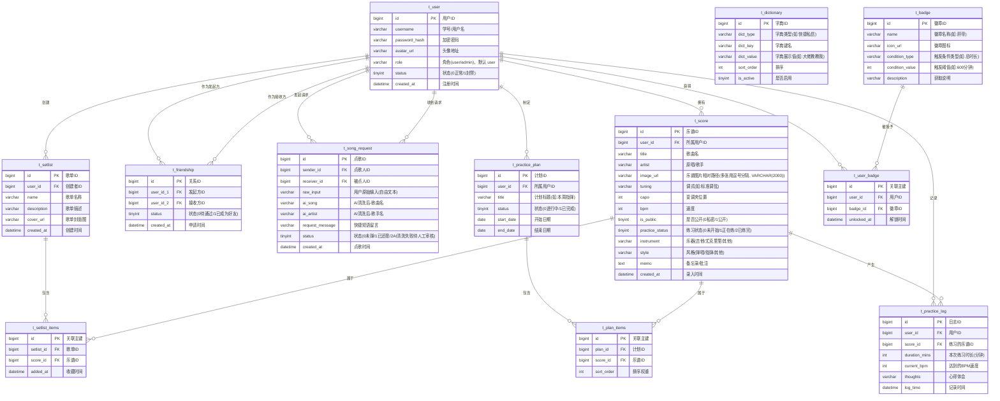

```mermaid
erDiagram
    %% ================= 核心实体表 =================
    t_user {
        bigint id PK "用户ID"
        varchar username "学号/用户名"
        varchar password_hash "加密密码"
        varchar avatar_url "头像地址"
        varchar role "角色(user/admin)，默认 user"
        tinyint status "状态(0正常/1封禁)"
        datetime created_at "注册时间"
    }
    
    t_score {
        bigint id PK "乐谱ID"
        bigint user_id FK "所属用户ID"
        varchar title "歌曲名"
        varchar artist "原唱/歌手"
        varchar image_url "乐谱图片相对路径(多张用逗号分隔, VARCHAR(2000))"
        varchar tuning "调式(如:标准调弦)"
        int capo "变调夹位置"
        int bpm "速度"
        tinyint is_public "是否公开(0私密/1公开)"
        tinyint practice_status "练习状态(0未开始/1正在练/2已练完)"
        varchar instrument "乐器(吉他/尤克里里/其他)"
        varchar style "风格(弹唱/指弹/其他)"
        text memo "备忘录/批注"
        datetime created_at "录入时间"
    }

    %% ================= 社交与互动表 =================
    t_friendship {
        bigint id PK "关系ID"
        bigint user_id_1 FK "发起方ID"
        bigint user_id_2 FK "接收方ID"
        tinyint status "状态(0待通过/1已成为好友)"
        datetime created_at "申请时间"
    }

    t_song_request {
        bigint id PK "点歌ID"
        bigint sender_id FK "点歌人ID"
        bigint receiver_id FK "被点人ID"
        varchar raw_input "用户原始输入(自由文本)"
        varchar ai_song "AI清洗后-歌曲名"
        varchar ai_artist "AI清洗后-歌手名"
        varchar request_message "快捷短语留言"
        tinyint status "状态(0未弹/1已还愿/2AI清洗失败待人工审核)"
        datetime created_at "点歌时间"
    }

    %% ================= 练习规划与日志表 =================
    t_practice_plan {
        bigint id PK "计划ID"
        bigint user_id FK "所属用户ID"
        varchar title "计划标题(如:本周指弹)"
        tinyint status "状态(0进行中/1已完成)"
        date start_date "开始日期"
        date end_date "结束日期"
    }

    t_plan_items {
        bigint id PK "关联主键"
        bigint plan_id FK "计划ID"
        bigint score_id FK "乐谱ID"
        int sort_order "排序权重"
    }

    t_practice_log {
        bigint id PK "日志ID"
        bigint user_id FK "用户ID"
        bigint score_id FK "练习的乐谱ID"
        int duration_mins "本次练习时长(分钟)"
        int current_bpm "达到的BPM速度"
        varchar thoughts "心得体会"
        datetime log_time "记录时间"
    }

    %% ================= 歌单组织表 =================
    t_setlist {
        bigint id PK "歌单ID"
        bigint user_id FK "创建者ID"
        varchar name "歌单名称"
        varchar description "歌单描述"
        varchar cover_url "歌单封面图"
        datetime created_at "创建时间"
    }

    t_setlist_items {
        bigint id PK "关联主键"
        bigint setlist_id FK "歌单ID"
        bigint score_id FK "乐谱ID"
        datetime added_at "收藏时间"
    }

    %% ================= 系统级与游戏化表 =================
    t_dictionary {
        bigint id PK "字典ID"
        varchar dict_type "字典类型(如:快捷私信)"
        varchar dict_key "字典键名"
        varchar dict_value "字典展示值(如:大佬教教我)"
        int sort_order "排序"
        tinyint is_active "是否启用"
    }

    t_badge {
        bigint id PK "徽章ID"
        varchar name "徽章名称(如:肝帝)"
        varchar icon_url "徽章图标"
        varchar condition_type "触发条件类型(如:总时长)"
        int condition_value "触发阈值(如:600分钟)"
        varchar description "获取说明"
    }

    t_user_badge {
        bigint id PK "关联主键"
        bigint user_id FK "用户ID"
        bigint badge_id FK "徽章ID"
        datetime unlocked_at "解锁时间"
    }

    %% ================= 物理表之间的外键关系连线 =================
    
    t_user ||--o{ t_score : "拥有"
    t_user ||--o{ t_setlist : "创建"
    t_user ||--o{ t_practice_plan : "制定"
    t_user ||--o{ t_practice_log : "记录"
    t_user ||--o{ t_song_request : "发起请求"
    t_user ||--o{ t_song_request : "收到请求"
    
    %% 自引用好友关系拆解为中间表
    t_user ||--o{ t_friendship : "作为发起方"
    t_user ||--o{ t_friendship : "作为接收方"

    %% 徽章多对多拆解
    t_user ||--o{ t_user_badge : "获得"
    t_badge ||--o{ t_user_badge : "被授予"

    %% 歌单多对多拆解
    t_setlist ||--o{ t_setlist_items : "包含"
    t_score ||--o{ t_setlist_items : "属于"

    %% 计划多对多拆解
    t_practice_plan ||--o{ t_plan_items : "包含"
    t_score ||--o{ t_plan_items : "属于"

    %% 练习日志关联
    t_score ||--o{ t_practice_log : "产生"
```
