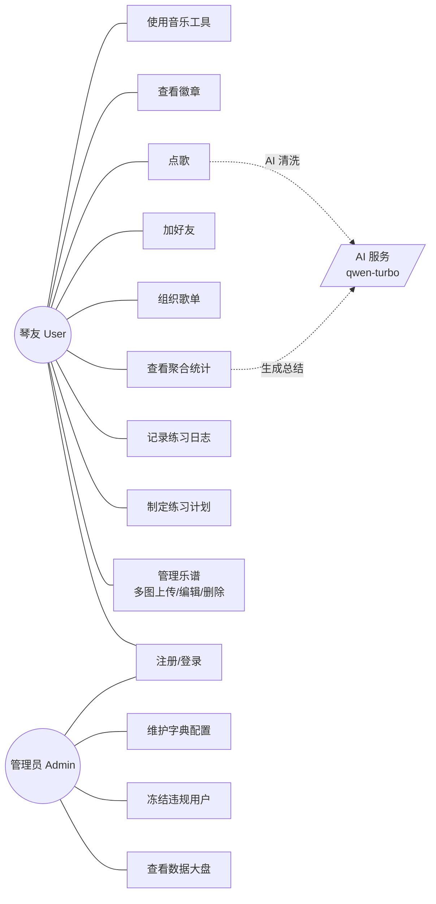
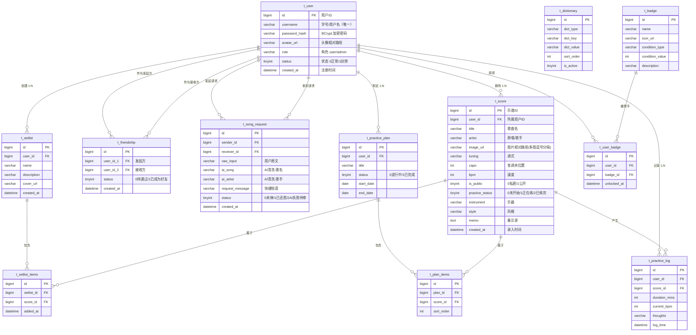
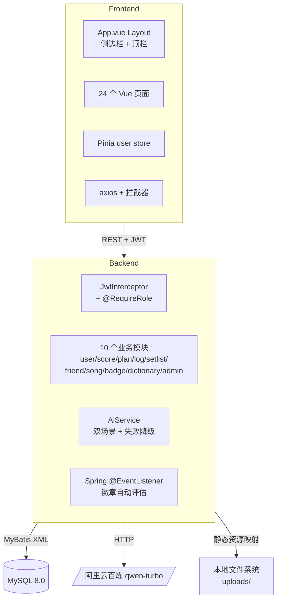

# 数据库分析与设计实习 · 课程设计报告

> **项目名称**：LyraScore 云端谱仓 — 数字化乐谱资源管理与协作系统
>
> **作者填写区**（粘进 Word 后改）：
> - 学号：`[填写：你的学号]`
> - 姓名：`[填写：你的姓名]`
> - 班级：`[填写：你的班级]`
> - 指导教师：`[填写：教师姓名]`
> - 学年学期：`[填写：YYYY-YYYY 学年第 X 学期]`
>
> **使用本草稿的步骤**（写在最前提醒自己）：
> 1. 通读全文，决定哪些段落要改写得更像「自己写的」
> 2. 对照 `docs/截图清单.md` 跑应用截图，存到 `docs/screenshots/`
> 3. 把每节内容**章节级**复制粘贴进学校官方 .docx 模板（先填模板封面 / 目录页 / 页眉页脚）
> 4. 按占位 `[插入截图：xxx]` 把对应图片插入 Word
> 5. 把所有 ` ```mermaid ` 代码块在 https://mermaid.live 渲染 → 导出 PNG → 替换占位
> 6. 改写「6 个人总结」为自己的真实反思
> 7. 统一字体（中文宋体小四 / 英文 Times New Roman 12 / 标题黑体）+ 加页眉页脚 + 刷新目录

---

## 1. 引言

### 1.1 应用内容

LyraScore（中文名：云端谱仓）是一个面向**业余吉他练习者**的、**全栈分离架构**的 Web 应用系统。系统围绕「练琴」这一核心业务流程构建，覆盖了从**乐谱资产入库 → 练习计划制定 → 练习日志记录 → 数据聚合统计 → 歌单组织 → 社交互动 → 游戏化激励**的完整闭环，并集成了**两类 AI 应用场景**和**三个实用音乐工具**作为创新亮点。

系统提供了 **6 个核心业务模块** + **1 个管理员后台模块** + **3 个实用音乐工具**，共 12 张数据表、近 50 个 RESTful 接口、24 个前端页面。

### 1.2 编写目的

本课程设计的核心目标是**通过一个具有真实业务复杂度的项目，综合训练数据库系统课程所学的关键技术**，包括但不限于：

1. **三种典型数据关系建模**：1:N、N:M（通过关联表）、**自引用 N:M**（好友关系）
2. **关键 SQL 技术**：`JOIN` 多表联合查询、`GROUP BY` 聚合统计、`CASE` 表达式、`COALESCE` 空值处理、`DATE()` 函数、复合索引、唯一键约束、外键 `CASCADE`/`RESTRICT` 策略选型
3. **事务与一致性**：通过 `INSERT IGNORE` + 唯一键实现幂等、通过 `ON DELETE CASCADE` 实现关联表级联清理
4. **业务与数据架构融合**：把「为什么这张表这样建」「为什么这条 SQL 这样写」与实际业务诉求绑定，避免脱离场景的纯技术堆砌

同时也借助这个项目延伸实践了：
- 后端：Spring Boot + MyBatis 的标准三层架构、手写 JWT 拦截器、自定义注解 `@RequireRole` 实现 RBAC、Spring `@EventListener` 实现事件驱动
- 前端：Vue 3 + Element Plus + Pinia 的现代 SPA 开发、axios 拦截器封装、Web Audio API 原生实现音频功能
- AI 集成：调用阿里云百炼 `qwen-turbo` 实现 NLP 文本清洗与个性化报告生成，并设计**失败降级策略**保证业务可用性

### 1.3 参考资料

| 编号 | 资料名称 | 来源 |
|---|---|---|
| [1] | Abraham Silberschatz, Henry F. Korth, S. Sudarshan. *Database System Concepts (6th Edition)*. McGraw-Hill, 2019. | 课程教材 |
| [2] | Spring Boot Reference Documentation. | https://docs.spring.io/spring-boot/docs/3.2.x/reference/html/ |
| [3] | MyBatis 3 用户指南. | https://mybatis.org/mybatis-3/zh_CN/ |
| [4] | Vue 3 官方文档（中文）. | https://cn.vuejs.org/ |
| [5] | Element Plus 组件库文档. | https://element-plus.org/zh-CN/ |
| [6] | 阿里云百炼 DashScope 模型 API 文档. | https://help.aliyun.com/zh/dashscope/ |
| [7] | OpenCC 简繁转换 JS 移植版. | https://github.com/nk2028/opencc-js |
| [8] | MDN — Web Audio API. | https://developer.mozilla.org/zh-CN/docs/Web/API/Web_Audio_API |

---

## 2. 需求分析

### 2.1 系统功能分析

#### 2.1.1 背景

吉他自学者长期面临三个真实痛点：

1. **乐谱散乱**：从各处下载/扫描的吉他谱图片没有统一管理工具，找一首曲子要翻几个文件夹；
2. **练习无记录**：「我这首练了多久了？」「上次练到 BPM 多少？」靠脑记不可靠，进步无法量化；
3. **琴友互动门槛高**：即使有微信群，也很难围绕「同一首曲子」形成有效讨论，「点歌」（让会弹的人帮我录一段或给我一份谱）需求的承载工具缺失。

LyraScore 直击这三个痛点，把「乐谱 + 练习 + 社交」三个长期割裂的场景在一个系统里打通。

#### 2.1.2 功能描述

系统按角色与功能切分为以下模块：

| 模块 | 用户角色 | 主要功能 |
|---|---|---|
| 模块一：用户中心 | User | 注册、登录、JWT 鉴权、个人信息（基础） |
| 模块二：谱仓 | User（Owner） | 乐谱**多图**上传、元数据编辑、练习状态切换、按乐器/风格/状态筛选、关键字搜索、阅读工具条（1页/2页/全屏） |
| 模块三：练习计划与日志 | User | 创建有时限练习计划、N:M 关联乐谱、记录练习时长/BPM/心得、聚合统计（GROUP BY）、**AI 练习总结生成** |
| 模块四：歌单 | User | 创建歌单、N:M 收藏乐谱 |
| 模块五：社交 | User | 加好友（自引用 N:M）、**AI 智能点歌**（自由文本→AI 清洗成 `(歌名, 歌手)`）、快捷短语点歌 |
| 模块六：成就徽章 | User（自动） | 17 张徽章、7 种触发条件、Spring `@EventListener` 自动评估发牌 |
| 模块七：实用工具 | User | 吉他定音器（5 种调弦）、节拍器（30-250 BPM）、找谱搜索（**简繁自动转换** + 多站快搜） |
| 模块八：管理员后台 | Admin | 跨表数据大盘（COUNT + SUM 聚合）、用户管理（冻结/解冻）、字典管理（CRUD） |

#### 2.1.3 用户功能详述

**a. 用户中心**
1. 注册：填写用户名（3-50 字符，唯一）+ 密码（6-50 字符）→ 后端用 BCrypt 哈希入库
2. 登录：返回 JWT token，token 默认有效期 24 小时；前端存 Pinia + localStorage
3. 拦截：除 `/auth/**` 和 `/uploads/**` 外，所有接口经 `JwtInterceptor` 校验

**b. 谱仓**
1. 上传：el-upload 多图选择（最多 12 张），同时填歌曲名、歌手、乐器、风格、调式、变调夹、BPM、备忘录
2. 列表：网格卡片展示，左上角状态角标（灰=未开始 / 橙=正在练 / 绿=已练完）
3. 筛选：4 组 chip——乐器、风格、状态、排序（最新存 / 最早存 / 按名 A-Z）
4. 搜索：实时按曲名或歌手关键字过滤
5. 详情：阅读工具条（**1 页 / 2 页 切换**、**🔍 大图预览**、**⛶ 全屏**）、状态切换条、备忘录显示
6. 编辑：可改全部元数据（**图片不可改**，需删除重传）
7. 删除：级联清理歌单 / 计划关联（CASCADE），但保护练习日志（RESTRICT）

**c. 练习计划与日志**
1. 创建计划：填标题 + 起止日期 → 落 `t_practice_plan`
2. 加曲：从「我的乐谱」选一首加入计划 → 落 `t_plan_items`（N:M 关联表）
3. 记录练习：选某首乐谱 → 填时长（必填）、本次 BPM、心得 → 落 `t_practice_log`，并发布 `PracticeLogCreatedEvent` 事件
4. 聚合统计：`/logs/stats` 返回总分钟、本周分钟、按乐谱分组（GROUP BY）、近 7 日按日分组（DATE 函数）
5. **AI 练习总结**：`/logs/report` 把 stats JSON 喂给 qwen-turbo → 120-200 字教练点评（累计/本周时长亮点 + 最爱曲目分析 + 近 7 天节奏）。AI 失败时本地拼接 fallback 文案

**d. 歌单**
1. 创建：填名称 + 简介
2. 收藏：从我的或公开乐谱选取加入歌单（N:M 关联）
3. 删除：歌单删除时关联表级联清理；乐谱删除时也自动从所有歌单清理

**e. 社交**
1. 加好友：搜对方用户名 → 发申请 → 对方接受 → 双方都解锁「不再孤单」徽章
2. 待处理列表：tab 显示收到的申请，可接受 / 拒绝
3. 我的好友：列出已成为好友的对端用户（**自引用 N:M 双向查询**，用 `CASE` 表达式选对端）
4. AI 点歌：选好友 + 输自由文本（如「霉霉的 cardigan 求弹」） + 选快捷短语 → 后端调 qwen-turbo 清洗 → 返回 `{song: "cardigan", artist: "Taylor Swift"}` 入库
5. 快捷短语：从 `t_dictionary` 读 `dict_type='quick_dm'` 的启用条目作为下拉选项
6. AI 失败：status=2，前端显示「AI 失败 / 待人工审核」+ 「🔄 重新清洗」按钮

**f. 徽章**
1. 17 张徽章覆盖 7 类触发条件：first_log / total_minutes (4 档) / log_count (2 档) / score_count (3 档) / plan_count / setlist_count / friend_count (2 档) / song_request_count
2. 自动发牌：用户行为触发后通过 `@EventListener` 或直调 `BadgeService.evaluateAndAward` 评估
3. 进度条：未解锁徽章显示「45 / 60 分钟」式进度，已解锁显示解锁时间

**g. 工具**
1. 定音器：6 弦交互，5 种调弦预设（Standard / Drop D / Open D / Open G / DADGAD），整体降调 0~-6 半音；变调用 `BufferSource.playbackRate = 2^(semitones/12)`
2. 节拍器：30-250 BPM，4 种拍号，强拍 1.5x 倍速制造重音
3. 找谱搜索：3 站（91pu 繁体 / 弹琴吧 / 不休吉他），输简体后 opencc-js 自动转繁体再发送，「一键多站搜」同时打开 3 个标签

**h. 管理员后台**
1. 数据大盘：9 项全站聚合（COUNT + SUM）
2. 用户管理：列表 + 冻结/解冻；admin 账号无法被冻结
3. 字典管理：增 / 改 / 启停 / 删除；前端 dict_type 改下拉、dict_key 自动建议

### 2.2 用例图



> 渲染：把上面 mermaid 代码块复制到 https://mermaid.live → 自动渲染 → 右上角 Actions → Download PNG → 插入 Word。

---

## 3. 数据库设计

### 3.1 概念结构设计

经过需求分析，识别出 **12 张数据表**，分为四组：

- **核心实体组**：`t_user`（用户）、`t_score`（乐谱）
- **社交与互动组**：`t_friendship`（自引用 N:M 好友）、`t_song_request`（点歌请求）
- **练习规划与日志组**：`t_practice_plan`、`t_plan_items`、`t_practice_log`
- **组织与游戏化组**：`t_setlist`、`t_setlist_items`、`t_dictionary`、`t_badge`、`t_user_badge`

**E-R 图（Mermaid ERD）**：



> [插入图片：把上面 mermaid 代码块用 mermaid.live 渲染后的 E-R 图 PNG]

#### 3.1.1 三种数据关系类型解析

本系统数据库**完整覆盖了关系数据库三种典型关系**，是本项目数据库设计的核心亮点：

**① 1:N（一对多）—— 用户与其拥有的资源**

```
t_user ──< t_score      （一个用户拥有多个乐谱）
t_user ──< t_practice_plan
t_user ──< t_practice_log
t_user ──< t_setlist
```

实现方式：在「多」端表中放外键 `user_id` 指向 `t_user.id`。

**② N:M（多对多）—— 通过关联表分解**

| 业务关系 | 关联表 | 唯一键约束 |
|---|---|---|
| 计划-乐谱（一个计划包含多首乐谱，一首乐谱可被多个计划包含） | `t_plan_items` | `uk_plan_items_pair (plan_id, score_id)` |
| 歌单-乐谱 | `t_setlist_items` | `uk_setlist_items_pair (setlist_id, score_id)` |
| 用户-徽章 | `t_user_badge` | `uk_user_badge_pair (user_id, badge_id)` |

唯一键约束保证业务上「同一对实体不能重复关联」（同一首谱不能在同一计划里出现两次）。这种约束在代码中配合 `INSERT IGNORE` 可以**优雅地实现幂等**。

**③ 自引用 N:M（特殊关系，本项目最大数据库设计亮点）—— 好友关系**

`t_friendship` 同时引用 `t_user.id` **两次**（`user_id_1` 和 `user_id_2`），形成自引用多对多。这种关系的复杂性在于：

> 「我」可能在 `user_id_1` 字段中，也可能在 `user_id_2` 字段中。查询「我的所有好友」时需要**同时从两个方向**查找，并动态选取「对端用户」。

解决方案使用 SQL `CASE WHEN` 表达式动态决定 JOIN 哪一边，详见 §4.4.2 教学示例。

### 3.2 逻辑结构设计

#### 3.2.1 关系模式图

按数据库范式（3NF）整理后，12 张表的关系模式如下（带下划线为主键）：

```
t_user           (id, username, password_hash, avatar_url, role, status, created_at)
                  └─ uk: username

t_score          (id, user_id, title, artist, image_url, tuning, capo, bpm,
                  is_public, practice_status, instrument, style, memo, created_at)
                  └─ fk: user_id → t_user.id

t_friendship     (id, user_id_1, user_id_2, status, created_at)
                  └─ uk: (user_id_1, user_id_2)
                  └─ fk: user_id_1 → t_user.id, user_id_2 → t_user.id

t_song_request   (id, sender_id, receiver_id, raw_input, ai_song, ai_artist,
                  request_message, status, created_at)
                  └─ fk: sender_id, receiver_id → t_user.id

t_practice_plan  (id, user_id, title, status, start_date, end_date)
                  └─ fk: user_id → t_user.id

t_plan_items     (id, plan_id, score_id, sort_order)
                  └─ uk: (plan_id, score_id)
                  └─ fk: plan_id → t_practice_plan.id (CASCADE)
                         score_id → t_score.id          (CASCADE)

t_practice_log   (id, user_id, score_id, duration_mins, current_bpm,
                  thoughts, log_time)
                  └─ fk: user_id → t_user.id  (RESTRICT)
                         score_id → t_score.id (RESTRICT)

t_setlist        (id, user_id, name, description, cover_url, created_at)
                  └─ fk: user_id → t_user.id

t_setlist_items  (id, setlist_id, score_id, added_at)
                  └─ uk: (setlist_id, score_id)
                  └─ fk: setlist_id → t_setlist.id (CASCADE)
                         score_id → t_score.id      (CASCADE)

t_dictionary     (id, dict_type, dict_key, dict_value, sort_order, is_active)
                  └─ uk: (dict_type, dict_key)

t_badge          (id, name, icon_url, condition_type, condition_value, description)
                  └─ uk: name

t_user_badge     (id, user_id, badge_id, unlocked_at)
                  └─ uk: (user_id, badge_id)
                  └─ fk: user_id → t_user.id, badge_id → t_badge.id
```

#### 3.2.2 数据库表设计（详细字段）

下面按业务分组列出 12 张表的字段表（与 schema.sql 完全一致）。

> [插入截图：D1 — DBeaver 左侧导航展开 lyrascore 库，看到 12 张 t_xxx 表]

##### 表 1：t_user（用户表）

| 字段名 | 数据类型 | 约束 | 说明 |
|---|---|---|---|
| id | BIGINT | PK, AUTO_INCREMENT | 用户 ID |
| username | VARCHAR(50) | NOT NULL, UNIQUE | 学号或用户名 |
| password_hash | VARCHAR(255) | NOT NULL | BCrypt 哈希后的密码 |
| avatar_url | VARCHAR(500) | NULL | 头像相对路径 |
| role | VARCHAR(20) | NOT NULL DEFAULT 'user' | 角色：user / admin |
| status | TINYINT | NOT NULL DEFAULT 0 | 0=正常，1=封禁 |
| created_at | DATETIME | NOT NULL DEFAULT CURRENT_TIMESTAMP | 注册时间 |

索引：`uk_user_username (username)`

##### 表 2：t_score（乐谱表）

| 字段名 | 数据类型 | 约束 | 说明 |
|---|---|---|---|
| id | BIGINT | PK, AUTO_INCREMENT | 乐谱 ID |
| user_id | BIGINT | NOT NULL, FK→t_user.id | 所属用户 |
| title | VARCHAR(100) | NOT NULL | 歌曲名 |
| artist | VARCHAR(100) | NULL | 原唱/歌手 |
| image_url | **VARCHAR(2000)** | NOT NULL | 乐谱图片相对路径，**多张用英文逗号分隔** |
| tuning | VARCHAR(50) | NULL | 调式（如：标准调弦 / Drop D） |
| capo | INT | NULL | 变调夹位置（0~12） |
| bpm | INT | NULL | 速度 BPM |
| is_public | TINYINT | NOT NULL DEFAULT 0 | 0=私密，1=公开 |
| practice_status | TINYINT | NOT NULL DEFAULT 0 | 0=未开始，1=正在练，2=已练完 |
| instrument | VARCHAR(20) | NULL | 乐器：吉他 / 尤克里里 / 其他 |
| style | VARCHAR(20) | NULL | 风格：弹唱 / 指弹 / 其他 |
| memo | TEXT | NULL | 备忘录/批注 |
| created_at | DATETIME | NOT NULL DEFAULT CURRENT_TIMESTAMP | 录入时间 |

索引：`idx_score_user_created (user_id, created_at)` —— 复合索引，加速「用户的乐谱按时间排列」这种最高频查询。

> [插入截图：D2 — t_score 表的 columns 视图]

##### 表 3：t_friendship（好友关系表，自引用 N:M）

| 字段名 | 数据类型 | 约束 | 说明 |
|---|---|---|---|
| id | BIGINT | PK, AUTO_INCREMENT | |
| user_id_1 | BIGINT | NOT NULL, FK→t_user.id | 发起方 |
| user_id_2 | BIGINT | NOT NULL, FK→t_user.id | 接收方 |
| status | TINYINT | NOT NULL DEFAULT 0 | 0=待通过，1=已成为好友 |
| created_at | DATETIME | NOT NULL DEFAULT CURRENT_TIMESTAMP | |

索引：
- `uk_friendship_pair (user_id_1, user_id_2)` —— **同一方向**的好友请求不能重复发起
- `idx_friendship_receiver (user_id_2, status)` —— 加速「我收到的待处理申请」查询

##### 表 4：t_song_request（点歌请求表）

| 字段名 | 数据类型 | 约束 | 说明 |
|---|---|---|---|
| id | BIGINT | PK, AUTO_INCREMENT | |
| sender_id | BIGINT | NOT NULL, FK→t_user.id | 点歌人 |
| receiver_id | BIGINT | NOT NULL, FK→t_user.id | 被点人 |
| raw_input | VARCHAR(500) | NOT NULL | 用户原始自由文本（如「霉霉的 cardigan」） |
| ai_song | VARCHAR(100) | NULL | AI 清洗后的歌曲名（如「cardigan」） |
| ai_artist | VARCHAR(100) | NULL | AI 清洗后的歌手名（如「Taylor Swift」） |
| request_message | VARCHAR(255) | NULL | 快捷短语（来自 t_dictionary） |
| status | TINYINT | NOT NULL DEFAULT 0 | 0=未弹，1=已还愿，2=AI 清洗失败待人工审核 |
| created_at | DATETIME | NOT NULL DEFAULT CURRENT_TIMESTAMP | |

##### 表 5：t_practice_plan（练习计划表）

| 字段名 | 数据类型 | 约束 | 说明 |
|---|---|---|---|
| id | BIGINT | PK, AUTO_INCREMENT | |
| user_id | BIGINT | NOT NULL, FK→t_user.id | 创建者 |
| title | VARCHAR(100) | NOT NULL | 计划标题 |
| status | TINYINT | NOT NULL DEFAULT 0 | 0=进行中，1=已完成 |
| start_date | DATE | NOT NULL | 开始日期 |
| end_date | DATE | NOT NULL | 结束日期 |

##### 表 6：t_plan_items（计划-乐谱 N:M 关联表）

| 字段名 | 数据类型 | 约束 | 说明 |
|---|---|---|---|
| id | BIGINT | PK, AUTO_INCREMENT | |
| plan_id | BIGINT | NOT NULL, FK→t_practice_plan.id (**CASCADE**) | 计划 ID |
| score_id | BIGINT | NOT NULL, FK→t_score.id (**CASCADE**) | 乐谱 ID |
| sort_order | INT | NOT NULL DEFAULT 0 | 排序权重 |

索引：`uk_plan_items_pair (plan_id, score_id)` —— 同一首谱不能在同一计划重复

##### 表 7：t_practice_log（练习日志表）

| 字段名 | 数据类型 | 约束 | 说明 |
|---|---|---|---|
| id | BIGINT | PK, AUTO_INCREMENT | |
| user_id | BIGINT | NOT NULL, FK→t_user.id (**RESTRICT**) | 用户 ID |
| score_id | BIGINT | NOT NULL, FK→t_score.id (**RESTRICT**) | 乐谱 ID |
| duration_mins | INT | NOT NULL | 本次练习时长（分钟） |
| current_bpm | INT | NULL | 本次达到的 BPM |
| thoughts | VARCHAR(500) | NULL | 心得 |
| log_time | DATETIME | NOT NULL DEFAULT CURRENT_TIMESTAMP | |

索引：
- `idx_log_user_time (user_id, log_time)` —— 用户日志按时间排
- `idx_log_score (score_id)` —— 按乐谱聚合统计

> 注意此处外键策略选用 **RESTRICT**——日志是「历史事实」，不允许因为乐谱被删而被级联清掉，否则会破坏聚合统计的正确性。

##### 表 8 / 9：t_setlist 与 t_setlist_items

`t_setlist` 字段与 `t_practice_plan` 类似（id / user_id / name / description / cover_url / created_at）；`t_setlist_items` 与 `t_plan_items` 结构对称（带 `uk_setlist_items_pair` 唯一键 + CASCADE 外键）。

##### 表 10：t_dictionary（通用字典表）

| 字段名 | 数据类型 | 约束 | 说明 |
|---|---|---|---|
| id | BIGINT | PK | |
| dict_type | VARCHAR(50) | NOT NULL | 字典分类（如 quick_dm） |
| dict_key | VARCHAR(50) | NOT NULL | 同分类内唯一键 |
| dict_value | VARCHAR(255) | NOT NULL | 展示值 |
| sort_order | INT | NOT NULL DEFAULT 0 | 排序权重，数字越小越靠前 |
| is_active | TINYINT | NOT NULL DEFAULT 1 | 启用/停用 |

索引：
- `uk_dictionary_type_key (dict_type, dict_key)`
- `idx_dictionary_type_active (dict_type, is_active, sort_order)` —— 加速点歌弹窗读取启用条目

##### 表 11 / 12：t_badge 与 t_user_badge

`t_badge` 定义徽章（id / name / icon_url / condition_type / condition_value / description）；`t_user_badge` 是 N:M 关联表，记录哪个用户解锁了哪个徽章 + 解锁时间。

`uk_user_badge_pair (user_id, badge_id)` 唯一键配合 `INSERT IGNORE` 实现幂等发牌——同一徽章重复评估不会重复授予。

### 3.3 物理结构设计

#### 3.3.1 利用 DDL 描述的物理数据库

**完整的表创建 SQL**（来源：`backend/src/main/resources/db/schema.sql`）：

```sql
-- ============================================================
-- LyraScore 数据库表结构（DDL）
-- 字符集：utf8mb4（适配中文与 emoji）
-- 引擎：InnoDB（支持外键、事务）
-- 命名：表名 t_ 前缀，列名 snake_case
-- ============================================================

-- 反向依赖顺序 DROP，保证脚本可重复执行
DROP TABLE IF EXISTS t_user_badge;
DROP TABLE IF EXISTS t_badge;
DROP TABLE IF EXISTS t_dictionary;
DROP TABLE IF EXISTS t_setlist_items;
DROP TABLE IF EXISTS t_setlist;
DROP TABLE IF EXISTS t_practice_log;
DROP TABLE IF EXISTS t_plan_items;
DROP TABLE IF EXISTS t_practice_plan;
DROP TABLE IF EXISTS t_song_request;
DROP TABLE IF EXISTS t_friendship;
DROP TABLE IF EXISTS t_score;
DROP TABLE IF EXISTS t_user;


-- 1. t_user — 用户
CREATE TABLE t_user (
    id              BIGINT          NOT NULL AUTO_INCREMENT             COMMENT '用户ID',
    username        VARCHAR(50)     NOT NULL                            COMMENT '学号/用户名',
    password_hash   VARCHAR(255)    NOT NULL                            COMMENT 'BCrypt 加密密码',
    avatar_url      VARCHAR(500)    DEFAULT NULL                        COMMENT '头像相对路径',
    role            VARCHAR(20)     NOT NULL DEFAULT 'user'             COMMENT '角色：user / admin',
    status          TINYINT         NOT NULL DEFAULT 0                  COMMENT '状态：0正常 / 1封禁',
    created_at      DATETIME        NOT NULL DEFAULT CURRENT_TIMESTAMP  COMMENT '注册时间',
    PRIMARY KEY (id),
    UNIQUE KEY uk_user_username (username)
) ENGINE=InnoDB DEFAULT CHARSET=utf8mb4 COLLATE=utf8mb4_0900_ai_ci COMMENT='用户表';


-- 2. t_score — 乐谱（含多图、状态、乐器、风格）
CREATE TABLE t_score (
    id              BIGINT          NOT NULL AUTO_INCREMENT             COMMENT '乐谱ID',
    user_id         BIGINT          NOT NULL                            COMMENT '所属用户ID',
    title           VARCHAR(100)    NOT NULL                            COMMENT '歌曲名',
    artist          VARCHAR(100)    DEFAULT NULL                        COMMENT '原唱/歌手',
    image_url       VARCHAR(2000)   NOT NULL                            COMMENT '图片相对路径，多张用 , 分隔',
    tuning          VARCHAR(50)     DEFAULT NULL                        COMMENT '调式',
    capo            INT             DEFAULT NULL                        COMMENT '变调夹 0~12',
    bpm             INT             DEFAULT NULL                        COMMENT '速度 BPM',
    is_public       TINYINT         NOT NULL DEFAULT 0                  COMMENT '0私密/1公开',
    practice_status TINYINT         NOT NULL DEFAULT 0                  COMMENT '0未开始/1正在练/2已练完',
    instrument      VARCHAR(20)     DEFAULT NULL                        COMMENT '吉他/尤克里里/其他',
    style           VARCHAR(20)     DEFAULT NULL                        COMMENT '弹唱/指弹/其他',
    memo            TEXT            DEFAULT NULL                        COMMENT '备忘录',
    created_at      DATETIME        NOT NULL DEFAULT CURRENT_TIMESTAMP,
    PRIMARY KEY (id),
    KEY idx_score_user_created (user_id, created_at),
    CONSTRAINT fk_score_user FOREIGN KEY (user_id) REFERENCES t_user (id)
        ON DELETE RESTRICT ON UPDATE CASCADE
) ENGINE=InnoDB DEFAULT CHARSET=utf8mb4 COLLATE=utf8mb4_0900_ai_ci COMMENT='乐谱表';


-- 3. t_friendship — 好友关系（自引用 N:M）
CREATE TABLE t_friendship (
    id              BIGINT          NOT NULL AUTO_INCREMENT,
    user_id_1       BIGINT          NOT NULL                            COMMENT '发起方',
    user_id_2       BIGINT          NOT NULL                            COMMENT '接收方',
    status          TINYINT         NOT NULL DEFAULT 0                  COMMENT '0待通过/1已成为好友',
    created_at      DATETIME        NOT NULL DEFAULT CURRENT_TIMESTAMP,
    PRIMARY KEY (id),
    UNIQUE KEY uk_friendship_pair (user_id_1, user_id_2),
    KEY idx_friendship_receiver (user_id_2, status),
    CONSTRAINT fk_friendship_user1 FOREIGN KEY (user_id_1) REFERENCES t_user (id)
        ON DELETE RESTRICT ON UPDATE CASCADE,
    CONSTRAINT fk_friendship_user2 FOREIGN KEY (user_id_2) REFERENCES t_user (id)
        ON DELETE RESTRICT ON UPDATE CASCADE
) ENGINE=InnoDB DEFAULT CHARSET=utf8mb4 COLLATE=utf8mb4_0900_ai_ci COMMENT='好友关系表';


-- 4. t_song_request — AI 智能点歌请求
CREATE TABLE t_song_request (
    id              BIGINT          NOT NULL AUTO_INCREMENT,
    sender_id       BIGINT          NOT NULL,
    receiver_id     BIGINT          NOT NULL,
    raw_input       VARCHAR(500)    NOT NULL                            COMMENT '用户原始输入',
    ai_song         VARCHAR(100)    DEFAULT NULL                        COMMENT 'AI 清洗后歌名',
    ai_artist       VARCHAR(100)    DEFAULT NULL                        COMMENT 'AI 清洗后歌手',
    request_message VARCHAR(255)    DEFAULT NULL                        COMMENT '快捷短语留言',
    status          TINYINT         NOT NULL DEFAULT 0                  COMMENT '0未弹/1已还愿/2 AI失败待审',
    created_at      DATETIME        NOT NULL DEFAULT CURRENT_TIMESTAMP,
    PRIMARY KEY (id),
    KEY idx_song_request_receiver (receiver_id, status),
    KEY idx_song_request_sender (sender_id, created_at),
    CONSTRAINT fk_song_request_sender   FOREIGN KEY (sender_id)   REFERENCES t_user (id),
    CONSTRAINT fk_song_request_receiver FOREIGN KEY (receiver_id) REFERENCES t_user (id)
) ENGINE=InnoDB DEFAULT CHARSET=utf8mb4 COMMENT='AI 智能点歌请求表';


-- 5. t_practice_plan — 练习计划
CREATE TABLE t_practice_plan (
    id              BIGINT          NOT NULL AUTO_INCREMENT,
    user_id         BIGINT          NOT NULL,
    title           VARCHAR(100)    NOT NULL,
    status          TINYINT         NOT NULL DEFAULT 0                  COMMENT '0进行中/1已完成',
    start_date      DATE            NOT NULL,
    end_date        DATE            NOT NULL,
    PRIMARY KEY (id),
    KEY idx_plan_user (user_id, status),
    CONSTRAINT fk_plan_user FOREIGN KEY (user_id) REFERENCES t_user (id)
) ENGINE=InnoDB DEFAULT CHARSET=utf8mb4 COMMENT='练习计划表';


-- 6. t_plan_items — 计划-乐谱（N:M 关联表，CASCADE）
CREATE TABLE t_plan_items (
    id              BIGINT          NOT NULL AUTO_INCREMENT,
    plan_id         BIGINT          NOT NULL,
    score_id        BIGINT          NOT NULL,
    sort_order      INT             NOT NULL DEFAULT 0,
    PRIMARY KEY (id),
    UNIQUE KEY uk_plan_items_pair (plan_id, score_id),
    KEY idx_plan_items_score (score_id),
    CONSTRAINT fk_plan_items_plan  FOREIGN KEY (plan_id)  REFERENCES t_practice_plan (id)
        ON DELETE CASCADE ON UPDATE CASCADE,
    CONSTRAINT fk_plan_items_score FOREIGN KEY (score_id) REFERENCES t_score (id)
        ON DELETE CASCADE ON UPDATE CASCADE
) ENGINE=InnoDB DEFAULT CHARSET=utf8mb4 COMMENT='计划-乐谱关联表';


-- 7. t_practice_log — 练习日志（RESTRICT 保护历史）
CREATE TABLE t_practice_log (
    id              BIGINT          NOT NULL AUTO_INCREMENT,
    user_id         BIGINT          NOT NULL,
    score_id        BIGINT          NOT NULL,
    duration_mins   INT             NOT NULL,
    current_bpm     INT             DEFAULT NULL,
    thoughts        VARCHAR(500)    DEFAULT NULL,
    log_time        DATETIME        NOT NULL DEFAULT CURRENT_TIMESTAMP,
    PRIMARY KEY (id),
    KEY idx_log_user_time (user_id, log_time),
    KEY idx_log_score (score_id),
    CONSTRAINT fk_log_user  FOREIGN KEY (user_id)  REFERENCES t_user (id)  ON DELETE RESTRICT,
    CONSTRAINT fk_log_score FOREIGN KEY (score_id) REFERENCES t_score (id) ON DELETE RESTRICT
) ENGINE=InnoDB DEFAULT CHARSET=utf8mb4 COMMENT='练习日志表';


-- 8. t_setlist
CREATE TABLE t_setlist (
    id              BIGINT          NOT NULL AUTO_INCREMENT,
    user_id         BIGINT          NOT NULL,
    name            VARCHAR(100)    NOT NULL,
    description     VARCHAR(255)    DEFAULT NULL,
    cover_url       VARCHAR(500)    DEFAULT NULL,
    created_at      DATETIME        NOT NULL DEFAULT CURRENT_TIMESTAMP,
    PRIMARY KEY (id),
    KEY idx_setlist_user (user_id, created_at),
    CONSTRAINT fk_setlist_user FOREIGN KEY (user_id) REFERENCES t_user (id)
) ENGINE=InnoDB DEFAULT CHARSET=utf8mb4 COMMENT='歌单表';


-- 9. t_setlist_items（CASCADE）
CREATE TABLE t_setlist_items (
    id              BIGINT          NOT NULL AUTO_INCREMENT,
    setlist_id      BIGINT          NOT NULL,
    score_id        BIGINT          NOT NULL,
    added_at        DATETIME        NOT NULL DEFAULT CURRENT_TIMESTAMP,
    PRIMARY KEY (id),
    UNIQUE KEY uk_setlist_items_pair (setlist_id, score_id),
    KEY idx_setlist_items_score (score_id),
    CONSTRAINT fk_setlist_items_setlist FOREIGN KEY (setlist_id) REFERENCES t_setlist (id)
        ON DELETE CASCADE ON UPDATE CASCADE,
    CONSTRAINT fk_setlist_items_score   FOREIGN KEY (score_id)   REFERENCES t_score (id)
        ON DELETE CASCADE ON UPDATE CASCADE
) ENGINE=InnoDB DEFAULT CHARSET=utf8mb4 COMMENT='歌单-乐谱关联表';


-- 10. t_dictionary
CREATE TABLE t_dictionary (
    id              BIGINT          NOT NULL AUTO_INCREMENT,
    dict_type       VARCHAR(50)     NOT NULL,
    dict_key        VARCHAR(50)     NOT NULL,
    dict_value      VARCHAR(255)    NOT NULL,
    sort_order      INT             NOT NULL DEFAULT 0,
    is_active       TINYINT         NOT NULL DEFAULT 1,
    PRIMARY KEY (id),
    UNIQUE KEY uk_dictionary_type_key (dict_type, dict_key),
    KEY idx_dictionary_type_active (dict_type, is_active, sort_order)
) ENGINE=InnoDB DEFAULT CHARSET=utf8mb4 COMMENT='通用字典表';


-- 11. t_badge
CREATE TABLE t_badge (
    id              BIGINT          NOT NULL AUTO_INCREMENT,
    name            VARCHAR(50)     NOT NULL,
    icon_url        VARCHAR(500)    DEFAULT NULL,
    condition_type  VARCHAR(50)     NOT NULL                            COMMENT '触发条件类型',
    condition_value INT             NOT NULL                            COMMENT '触发阈值',
    description     VARCHAR(255)    DEFAULT NULL,
    PRIMARY KEY (id),
    UNIQUE KEY uk_badge_name (name)
) ENGINE=InnoDB DEFAULT CHARSET=utf8mb4 COMMENT='徽章定义表';


-- 12. t_user_badge（INSERT IGNORE 配合 uk 实现幂等发牌）
CREATE TABLE t_user_badge (
    id              BIGINT          NOT NULL AUTO_INCREMENT,
    user_id         BIGINT          NOT NULL,
    badge_id        BIGINT          NOT NULL,
    unlocked_at     DATETIME        NOT NULL DEFAULT CURRENT_TIMESTAMP,
    PRIMARY KEY (id),
    UNIQUE KEY uk_user_badge_pair (user_id, badge_id),
    KEY idx_user_badge_badge (badge_id),
    CONSTRAINT fk_user_badge_user  FOREIGN KEY (user_id)  REFERENCES t_user (id),
    CONSTRAINT fk_user_badge_badge FOREIGN KEY (badge_id) REFERENCES t_badge (id)
) ENGINE=InnoDB DEFAULT CHARSET=utf8mb4 COMMENT='用户徽章关联表';
```

#### 3.3.2 索引与外键策略说明

**索引策略**（除主键外的关键索引）：

| 索引名 | 类型 | 表 | 用途 |
|---|---|---|---|
| `uk_user_username` | UNIQUE | t_user | 防重名 + 加速登录查询 |
| `idx_score_user_created` | 复合（user_id, created_at） | t_score | 「我的乐谱按时间倒排」最高频查询 |
| `uk_friendship_pair` | UNIQUE | t_friendship | 防止同方向重复发起好友请求 |
| `idx_friendship_receiver` | 复合（user_id_2, status） | t_friendship | 「我收到的待处理申请」 |
| `idx_log_user_time` | 复合（user_id, log_time） | t_practice_log | 用户日志按时间排 + 本周聚合 |
| `idx_log_score` | 单列（score_id） | t_practice_log | GROUP BY 按乐谱聚合 |
| `uk_*_pair` 系列 | UNIQUE | 4 张关联表 | 防重复关联 + 配合 INSERT IGNORE 实现幂等 |
| `idx_dictionary_type_active` | 复合（dict_type, is_active, sort_order） | t_dictionary | 加速点歌弹窗读取启用条目 |

**外键策略：CASCADE 与 RESTRICT 的分级使用**（本项目数据库设计的另一亮点）：

| 关系 | 策略 | 设计理由 |
|---|---|---|
| `t_plan_items.score_id` → `t_score.id` | **CASCADE** | 关联表本质是「关系」，乐谱被删，关系消失天经地义 |
| `t_setlist_items.score_id` → `t_score.id` | **CASCADE** | 同上 |
| `t_practice_log.score_id` → `t_score.id` | **RESTRICT** | 日志是历史事实，不允许因为源数据被删而消失（否则统计数据失真） |
| `t_friendship.user_id_*` → `t_user.id` | **RESTRICT** | 用户即使被冻结也不能直接删除，避免破坏好友关系图 |

这种「**关联型数据 CASCADE，历史事实型数据 RESTRICT**」的分级策略，是数据库设计的重要原则。

#### 3.3.3 种子数据 INSERT 语句

来源：`backend/src/main/resources/db/seed.sql`，可重复执行（依赖 `INSERT IGNORE`）：

```sql
-- 快捷点歌短语
INSERT IGNORE INTO t_dictionary (dict_type, dict_key, dict_value, sort_order, is_active) VALUES
  ('quick_dm', 'dm1', '大佬教教我',           10, 1),
  ('quick_dm', 'dm2', '这首给我一份谱呗',     20, 1),
  ('quick_dm', 'dm3', '催更催更',             30, 1),
  ('quick_dm', 'dm4', '弹这首！',             40, 1),
  ('quick_dm', 'dm5', '路过求一份指弹版',     50, 1);

-- 17 张徽章 + 7 种触发条件
INSERT IGNORE INTO t_badge (name, icon_url, condition_type, condition_value, description) VALUES
  ('初出茅庐',     '🎵', 'first_log',           1,    '完成第一次练习记录'),
  ('节奏新手',     '🌱', 'total_minutes',       30,   '累计练习达到 30 分钟'),
  ('肝帝预备役',   '🔥', 'total_minutes',       60,   '累计练习达到 60 分钟'),
  ('小有所成',     '🌿', 'total_minutes',       300,  '累计练习达到 5 小时'),
  ('真正的肝帝',   '💪', 'total_minutes',       600,  '累计练习达到 600 分钟'),
  ('练习狂热',     '🌳', 'total_minutes',       1800, '累计练习达到 30 小时'),
  ('琴技大师',     '🌲', 'total_minutes',       6000, '累计练习达到 100 小时'),
  ('坚持就是胜利', '⏳', 'log_count',           10,   '完成 10 次练习记录'),
  ('百炼成钢',     '⚒️', 'log_count',           50,   '完成 50 次练习记录'),
  ('乐谱猎人',     '🎼', 'score_count',         5,    '上传乐谱达到 5 张'),
  ('谱仓守护者',   '📚', 'score_count',         10,   '上传乐谱达到 10 张'),
  ('谱海无涯',     '🗺️', 'score_count',         20,   '上传乐谱达到 20 张'),
  ('运筹帷幄',     '📋', 'plan_count',          1,    '创建第一个练习计划'),
  ('歌单达人',     '🎵', 'setlist_count',       3,    '创建 3 个歌单'),
  ('不再孤单',     '🤝', 'friend_count',        1,    '添加第一位好友'),
  ('知音难觅',     '👥', 'friend_count',        5,    '拥有 5 位琴友'),
  ('点歌之王',     '🎤', 'song_request_count',  1,    '给好友点了第一首歌');
```

---

## 4. 系统设计与实现

### 4.1 环境与工具

| 类别 | 技术 / 版本 | 说明 |
|---|---|---|
| 操作系统 | Windows 10/11 | 开发与运行环境 |
| JDK | OpenJDK 17 LTS | Spring Boot 3 的最低要求 |
| 后端框架 | Spring Boot 3.2 | 全家桶，自动配置 + 内嵌 Tomcat |
| 持久层 | MyBatis 3.0（无 MyBatis-Plus） | 课程目标是写 SQL，保留 XML mapper 教学性 |
| 数据库 | MySQL 8.0 | utf8mb4 字符集 |
| 安全 | 自定义 JWT 拦截器（jjwt 0.12）+ jBCrypt 0.4 | 不引 Spring Security，自己实现机制 |
| 前端框架 | Vue 3（Composition API） | 现代响应式前端 |
| 前端 UI | Element Plus | 后台体面风组件库 |
| 前端构建 | Vite 5.x | HMR 极快 |
| 前端状态 | Pinia | Vue 3 官方推荐 |
| 前端路由 | Vue Router 4 | meta.requiresAuth / meta.requiresAdmin 路由守卫 |
| HTTP 客户端 | axios 1.x | 拦截器自动加 Bearer + 401 去重 |
| 简繁转换 | opencc-js（s2twp 模式） | 找谱搜索功能用 |
| 音频 API | Web Audio API（浏览器原生） | 定音器 + 节拍器变调 |
| AI 服务 | 阿里云百炼 qwen-turbo | OpenAI 兼容端点；点歌清洗 + 练习总结生成 |
| IDE | IntelliJ IDEA Community + VS Code | 后端 + 前端分工 |
| 数据库工具 | DBeaver 26 | 跨表查询 + 可视化 |
| 版本控制 | Git + GitHub | https://github.com/jungle122/LyraScore_web |

### 4.2 整体结构

#### 4.2.1 模块分解图



#### 4.2.2 模块设计

按业务领域切分为 **10 个后端模块** + **3 个基础设施模块**：

| 模块名 | 输入 | 处理 | 输出 | 关键 SQL |
|---|---|---|---|---|
| user | 用户名 + 密码 | BCrypt 哈希 + JWT 签发 | token + 角色 | INSERT / SELECT BY username |
| score | 多张图片 + 元数据 | 落本地磁盘 + DB 入库 | 乐谱 ID | INSERT / 条件查询 / UPDATE 元数据 / DELETE |
| plan | 标题 + 起止日期 + 乐谱 ID 列表 | 创建计划 + 加曲目 | 计划详情含乐谱列表 | **JOIN** 乐谱表查曲目 |
| log | 乐谱 ID + 时长 + BPM + 心得 | 入库 + 发布事件 | 日志 ID | INSERT + **GROUP BY 聚合** |
| setlist | 名称 + 描述 + 乐谱 ID 列表 | 创建歌单 + 收藏曲目 | 歌单详情 | JOIN + INSERT IGNORE |
| friend | 对方用户名 | 双向唯一键检测 + 接受/拒绝 | 我的好友列表 | **CASE 表达式自引用查询** |
| song | 自由文本 + 接收方 | AI 清洗 + 落库 | 点歌记录 | INSERT + UPDATE AI 字段 |
| badge | 用户行为事件 | 评估各类阈值 + INSERT IGNORE 授予 | 用户徽章列表 | LEFT JOIN 查解锁状态 |
| dictionary | （管理员）字典条目 | 增改删启停 | 字典列表 | CRUD + uk 约束 |
| admin | （管理员）查询请求 | 跨表 COUNT + SUM 聚合 | 大盘数据 / 用户列表 / 字典列表 | **跨多表 COUNT/SUM** |
| common（基础设施） | 异常 / 通用响应 | 全局异常处理 + R 包装 | `R<T>` 通用响应 | — |
| config（基础设施） | 拦截器 / 静态资源 | WebMvcConfigurer | — | — |
| util（基础设施） | JWT 字符串 | jjwt 签发/解析 | Claims | — |

#### 4.2.3 设计与实现技术

**a. 后端架构：Spring Boot + 三层 MVC**

后端采用经典 Controller-Service-Mapper 三层架构。Controller 处理 HTTP 接口，Service 实现业务逻辑，Mapper 通过 MyBatis XML 操作数据库。这种分层让每一层职责清晰：业务变了改 Service，SQL 变了改 Mapper XML，完全不用动 Controller。

**b. 持久层：MyBatis 3.0（保留 XML mapper）**

之所以选 MyBatis 而非 MyBatis-Plus 或 JPA，是因为本课程的核心目标就是**让学生写 SQL**。MyBatis-Plus 自动生成的 SQL 会让学生失去理解 JOIN、GROUP BY 等关键技术点的机会。我们在 `application-dev.yml` 中开启了 `map-underscore-to-camel-case`，让数据库列名 `created_at` 自动映射到 Java 字段 `createdAt`，减少手写 ResultMap 的重复劳动。

**c. 安全：手写 JWT 拦截器 + RBAC**

不依赖 Spring Security，而是自己实现 `HandlerInterceptor`：

```java
// JwtInterceptor.java 核心逻辑（精简版）
public boolean preHandle(HttpServletRequest req, ...) {
    String header = req.getHeader("Authorization");
    if (header == null || !header.startsWith("Bearer ")) {
        throw new BusinessException(401, "未登录或 token 缺失");
    }
    Claims claims = jwtUtil.parse(header.substring(7));
    Long userId = Long.parseLong(claims.getSubject());
    String role = claims.get("role", String.class);
    UserContext.set(userId, claims.get("username", String.class), role);

    // RBAC：检查 @RequireRole 注解
    RequireRole requireRole = handlerMethod.getMethodAnnotation(RequireRole.class);
    if (requireRole == null) {
        requireRole = handlerMethod.getBeanType().getAnnotation(RequireRole.class);
    }
    if (requireRole != null && !requireRole.value().equals(role)) {
        throw new BusinessException(403, "权限不足，需要角色: " + requireRole.value());
    }
    return true;
}
```

**自定义注解 `@RequireRole("admin")`** 加在 AdminController 类级别，所有 admin 接口自动启用 RBAC 校验。普通用户调用 admin 接口直接返回 403。

**d. 事件驱动：Spring `@EventListener` 替代数据库触发器**

PRD 早期方案用 DB 触发器实现徽章自动发牌，但触发器有几个缺点：
1. 业务逻辑散落在数据库，调试困难
2. 复杂条件用 SQL 写很别扭（switch case 类型分发）
3. 难以单元测试

切换到 Spring `@EventListener` 后：
- 主流程（写日志）发布事件 `PracticeLogCreatedEvent`
- `PracticeLogBadgeListener` 订阅事件，调 `BadgeService.evaluateAndAward(userId)`
- 业务逻辑全在 Java 层，可读、可调、可测

幂等性靠 `INSERT IGNORE INTO t_user_badge ...` 配合 `uk_user_badge_pair` 唯一键实现——重复评估不会重复授予。

**e. AI 集成：双场景 + 失败降级**

接入阿里云百炼 `qwen-turbo`（OpenAI 兼容端点），用 Spring 6 的 `RestClient` 直接发 HTTP，无需引入额外 SDK。

两个场景：
1. **点歌清洗**：自由文本 → JSON `{song, artist}`。system prompt 含艺名归一化 few-shot（霉霉 → Taylor Swift / 周董 → 周杰伦 / 碧梨 → Billie Eilish）。
2. **练习总结**：stats JSON → 120-200 字教练点评。temperature=0.7 让每次生成略有不同。

**关键设计：失败降级**。AI 接口可能因网络、限流、key 失效等原因失败。我们的设计是：
- 点歌：AI 失败 → 写入原文 + status=2 → 前端显示「AI 失败 / 待人工审核」+ 「重新清洗」按钮
- 练习总结：AI 失败 → 本地拼一段「累计 N 分钟，本周 N 分钟，加油」fallback 文案 → 业务永远不中断

**f. 前端：Vue 3 + Element Plus + Pinia + Vite**

App.vue 实现 sidebar + topbar 主布局，根据 `userStore.userInfo.role` 动态切换侧边栏：
- 普通用户：核心模块（7 项）+ 小工具（3 项）
- 管理员：仅管理员模块（3 项）

axios 拦截器自动给所有请求加 `Authorization: Bearer <token>`，并对 401 做去重处理（2 秒内的多次 401 只弹一次提示）。

### 4.3 系统界面设计

> 本章节包含系统所有核心界面截图。截图前请按 `docs/截图清单.md` 的准备工作步骤布置好测试数据。

#### 4.3.1 用户认证

**登录页**：暖色渐变背景，提供用户名/密码输入框 + 「去注册」链接。前端发起 POST `/auth/login`，后端校验通过后返回 JWT，前端存入 Pinia + localStorage。

> [插入截图：01_login.png]

**注册页**：用户名（3-50 字符）+ 密码（6-50 字符）+ 重复密码（前端校验一致性）。

> [插入截图：02_register.png]

#### 4.3.2 首页（Dashboard 风格）

按时间问候 + 4 张统计 tile（总练习时长、本周练习、乐谱数、解锁徽章数）+ 模块格栅（核心模块 7 张 + 小工具 3 张）。点击任何卡片跳转对应模块。

> [插入截图：03_home.png]

#### 4.3.3 谱仓

**列表页**：搜索框 + 4 组筛选条（乐器 / 风格 / 状态 / 排序）+ 卡片网格。每张卡片左上角是状态角标（灰=未开始 / 橙=正在练 / 绿=已练完）；右上角是删除按钮；图片是多图模式时右下角显示「3 图」标签。

> [插入截图：04_scores_list.png]

**上传页**：el-upload 多图选择（最多 12 张），用 picture-card 模式展示已选图片缩略图。表单字段：歌曲名（必填）/ 歌手 / 乐器（吉他/尤克里里/其他 radio）/ 风格（弹唱/指弹/其他 radio）/ 调式 / 变调夹 / BPM / 是否公开 switch / 备忘录。

> [插入截图：05_score_upload.png]

**详情页**：顶部琥珀色阅读工具条（**1 页 / 2 页显示** / **🔍 大图预览** / **⛶ 全屏显示**）+ 元数据 tag 行 + 状态切换 radio + 多张谱图竖排或两列网格（取决于 1页/2页 选项）+ 备忘录区域。点击任何图触发 lightbox 大图预览。

> [插入截图：06_score_detail.png]

#### 4.3.4 练习计划与日志

**计划详情页**：计划元信息（标题 / 起止日期 / 进行中/已完成状态）+ 关联乐谱列表（每行可点跳详情，可记录练习，可移除）。

> [插入截图：07_plan_detail.png]

**日志统计页**：3 张顶部统计卡 + **AI 练习总结卡片**（暖色渐变背景，含「生成练习总结」按钮和 AI 生成的文本）+ 「各曲累计时长」表（**GROUP BY 教学点**）+ 「近 7 日练习」表（**DATE() + GROUP BY 教学点**）+ 最近练习记录表（含删除按钮）。

> [插入截图：08_logs_stats.png]

#### 4.3.5 歌单

**详情页**：歌单元信息 + 收录乐谱列表。点击任何乐谱跳详情。

> [插入截图：09_setlist_detail.png]

#### 4.3.6 社交

**好友页**：3 个 tab —— 我的好友（已经互为好友的列表）/ 待处理（收到的申请）/ 添加好友（搜对方用户名发起申请）。

> [插入截图：10_friends.png]

**AI 点歌页**：双 tab「我点的 / 我收到的」+ 「+ 给好友点歌」按钮。每条记录显示状态标签 + AI 清洗结果（🤖 行）+ 原文 + 快捷短语。

> [插入截图：11_song_request.png]

#### 4.3.7 徽章

17 张徽章网格展示。已解锁的彩色 + 暖色背景 + 显示解锁时间；未解锁的灰度 + 进度条（如「45 / 60 分钟」）。顶部统计「3 / 17 已解锁」。

> [插入截图：12_badges.png]

#### 4.3.8 实用工具

**定音器**：调弦预设单选（Standard / Drop D / Open D / Open G / DADGAD）+ 整体降调滑块 + **深色木纹指板**（6 弦垂直排列，左粗右细，奶白色琴枕在顶部，4 条品丝横线）。点击任何琴弦发音，弦发光高亮。

> [插入截图：13_tuner.png]

**节拍器**：极简风——大字号 BPM 数字 + 160px 圆形播放按钮（播放中变实心黑底白方块）+ 4 个拍点圆指示灯（强拍颜色更深）+ ±1 / ±5 微调 + 滑块 + 拍号 radio。

> [插入截图：14_metronome.png]

**找谱搜索**：输入框（支持回车快搜）+ 「一键多站搜」按钮 + 简繁转换预览框（输入「霉霉的青花瓷」时实时显示繁体「霉霉的青花瓷」）+ 3 张站点卡片（91pu 繁体 / 弹琴吧 / 不休吉他），每张含「搜索」「首页」按钮。

> [插入截图：15_find_tab.png]

#### 4.3.9 管理员后台（仅 admin 角色）

**数据大盘**：9 张 tile —— 注册用户、上传乐谱、练习计划、练习日志、累计练琴分钟、歌单、好友对数、点歌请求、已颁徽章。所有数据通过 `AdminMapper` 的跨表 COUNT + SUM 查询实时计算。

> [插入截图：16_admin_dashboard.png]

**用户管理**：列出全站用户（含角色 tag、状态 tag、注册时间），可冻结/解冻；admin 账号的「冻结」按钮 disabled 防止误操作。

> [插入截图：17_admin_users.png]

**字典管理**：列表展示所有字典条目，「+ 新建条目」弹窗中 `dict_type` 是下拉、`dict_key` 自动建议、`sort_order` 步长 10、`is_active` 是 switch。

> [插入截图：18_admin_dict.png]

### 4.4 数据库连接与 SQL 实现

#### 4.4.1 MyBatis 配置

`application-dev.yml`：

```yaml
spring:
  datasource:
    url: jdbc:mysql://localhost:3306/lyrascore?useUnicode=true&characterEncoding=utf8&serverTimezone=Asia/Shanghai
    username: root
    password: ${DB_PASSWORD:root}
    driver-class-name: com.mysql.cj.jdbc.Driver

mybatis:
  mapper-locations: classpath:mapper/*.xml
  configuration:
    map-underscore-to-camel-case: true   # created_at → createdAt 自动映射
```

后端启动类 `LyraScoreApplication` 加 `@MapperScan("com.lyrascore.**.mapper")`，自动扫描所有 mapper 接口。

#### 4.4.2 部分增、删、改、查语句配置

下面挑选每个核心模块的代表性 SQL 展示。

##### ① INSERT —— 新增乐谱（含主键回写）

```xml
<!-- ScoreMapper.xml -->
<insert id="insert" parameterType="com.lyrascore.score.entity.Score"
        useGeneratedKeys="true" keyProperty="id">
    INSERT INTO t_score
        (user_id, title, artist, image_url, tuning, capo, bpm, is_public,
         practice_status, instrument, style, memo)
    VALUES
        (#{userId}, #{title}, #{artist}, #{imageUrl}, #{tuning}, #{capo}, #{bpm}, #{isPublic},
         #{practiceStatus}, #{instrument}, #{style}, #{memo})
</insert>
```

`useGeneratedKeys="true"` + `keyProperty="id"` 让 MyBatis 在 INSERT 后**把自增主键回写到 entity 的 id 字段**，方便 Service 层立刻拿到新建记录的 ID。

##### ② 条件查询 + 排序 —— 我的乐谱列表

```xml
<select id="selectByUser" resultMap="ScoreMap">
    SELECT <include refid="cols"/>
    FROM t_score
    WHERE user_id = #{userId}
    ORDER BY created_at DESC
</select>
```

走 `idx_score_user_created (user_id, created_at)` 复合索引，可以**索引覆盖排序**，无需额外 filesort。

##### ③ JOIN 多表联合 —— 计划详情含乐谱信息（教学点）

```xml
<!-- PlanMapper.xml -->
<select id="selectItemsByPlan" resultMap="PlanItemMap">
    SELECT
        pi.id, pi.plan_id, pi.score_id, pi.sort_order,
        s.title, s.artist, s.image_url
    FROM t_plan_items pi
    INNER JOIN t_score s ON pi.score_id = s.id
    WHERE pi.plan_id = #{planId}
    ORDER BY pi.sort_order ASC, pi.id ASC
</select>
```

**INNER JOIN 把关联表 + 主表合并查询**，一次 SQL 直接拿到「计划包含的乐谱 + 每首的歌名/歌手/封面」。否则要先查 `t_plan_items` 再循环 N+1 次去查 `t_score`，性能差且代码丑。

##### ④ GROUP BY 聚合统计 —— 按乐谱分组累计练习时长（教学点）

```xml
<!-- PracticeLogMapper.xml -->
<select id="sumByScore" resultType="java.util.Map">
    SELECT s.id          AS scoreId,
           s.title       AS scoreTitle,
           s.artist      AS scoreArtist,
           SUM(l.duration_mins) AS totalMins,
           COUNT(*)             AS sessions
    FROM t_practice_log l
    INNER JOIN t_score s ON l.score_id = s.id
    WHERE l.user_id = #{userId}
    GROUP BY s.id, s.title, s.artist
    ORDER BY totalMins DESC
</select>
```

**JOIN + GROUP BY + SUM + COUNT 四个聚合技术点一次性出现**。前端拿到结果直接渲染表格：「青花瓷 周杰伦 / 4 次 / 60 分钟」。

##### ⑤ DATE() 函数 + GROUP BY —— 近 7 日按日聚合（教学点）

```xml
<select id="sumByDay" resultType="java.util.Map">
    SELECT DATE(log_time)         AS day,
           SUM(duration_mins)     AS totalMins
    FROM t_practice_log
    WHERE user_id = #{userId}
      AND log_time >= #{since}
    GROUP BY DATE(log_time)
    ORDER BY day ASC
</select>
```

`DATE(log_time)` 把 DATETIME 强转 DATE，使得**同一天的多条日志被聚合成一行**。Java 端传入 `LocalDate.now().minusDays(6).atStartOfDay()` 作为 `since` 参数。

##### ⑥ 自引用 N:M + CASE 表达式 —— 我的好友双向查询（教学点 ⭐ 本项目最难 SQL）

```xml
<!-- FriendshipMapper.xml -->
<select id="selectFriendsOf" resultMap="FriendshipMap">
    SELECT
        f.id, f.user_id_1, f.user_id_2, f.status, f.created_at,
        u.id            AS other_user_id,
        u.username      AS other_username,
        u.avatar_url    AS other_avatar
    FROM t_friendship f
    INNER JOIN t_user u
            ON u.id = CASE WHEN f.user_id_1 = #{userId} THEN f.user_id_2 ELSE f.user_id_1 END
    WHERE (f.user_id_1 = #{userId} OR f.user_id_2 = #{userId})
      AND f.status = 1
    ORDER BY f.created_at DESC
</select>
```

> [插入截图：D3 — DBeaver 中执行此查询，看到结果集每行的 other_username 都是「我」之外的那个人]

**这条 SQL 用一个语句解决了「自引用 N:M 的双向查询」难题**：
- WHERE 子句 `OR` 同时匹配两个方向：「我作为发起方」OR「我作为接收方」
- JOIN ON 子句的 `CASE WHEN` 表达式动态决定 JOIN 哪一边的用户：
  - 如果我在 user_id_1，就 JOIN user_id_2 对应的用户
  - 如果我在 user_id_2，就 JOIN user_id_1 对应的用户
- 结果集的 `other_*` 字段总是「对端用户」，前端可以直接渲染为「我的好友：xxx」

##### ⑦ UPDATE —— 切换练习状态

```xml
<update id="updateStatus">
    UPDATE t_score SET practice_status = #{status}
    WHERE id = #{id} AND user_id = #{userId}
</update>
```

WHERE 同时带 `id` 和 `user_id` —— 即使有人猜到了别人的 score_id 也无法修改别人的乐谱状态。这种**「业务对象的所有权校验下沉到 SQL」**的写法是常见安全实践。

##### ⑧ DELETE + INSERT IGNORE 幂等 —— 歌单收藏 / 取消

```xml
<!-- 收藏 -->
<insert id="insertItem">
    INSERT INTO t_setlist_items (setlist_id, score_id) VALUES (#{setlistId}, #{scoreId})
</insert>

<!-- 取消收藏 -->
<delete id="deleteItem">
    DELETE FROM t_setlist_items
    WHERE setlist_id = #{setlistId} AND score_id = #{scoreId}
</delete>
```

INSERT 时如果触发 `uk_setlist_items_pair` 唯一键冲突，Spring 会抛 `DuplicateKeyException`，Service 层捕获并友好提示「已在歌单中」。

##### ⑨ 跨表聚合 —— 管理员数据大盘（教学点）

```xml
<!-- AdminMapper.xml 节选 -->
<select id="countUsers"        resultType="long">SELECT COUNT(*) FROM t_user</select>
<select id="countScores"       resultType="long">SELECT COUNT(*) FROM t_score</select>
<select id="countLogs"         resultType="long">SELECT COUNT(*) FROM t_practice_log</select>
<select id="countFriendships"  resultType="long">SELECT COUNT(*) FROM t_friendship WHERE status = 1</select>

<select id="sumAllPracticeMinutes" resultType="java.lang.Long">
    SELECT COALESCE(SUM(duration_mins), 0) FROM t_practice_log
</select>
```

`COALESCE(..., 0)` 确保表为空时返回 0 而非 NULL，避免前端 NPE。

#### 4.4.3 事务说明

本项目大部分接口是「单条 SQL 完成业务」，MyBatis 默认每条 SQL 自动事务，无需显式 `@Transactional`。

少数跨多表写入的场景（比如「上传乐谱」要先存图、再写库、最后评估徽章），如果中间任一步失败：
- 图片落盘是不可逆的（已写入文件系统），但**孤儿图片**不影响业务正确性，可由后台清理任务定期扫描
- DB 操作是原子的（单条 INSERT），不会出现部分成功

唯一需要关注的是事件监听器：`PracticeLogCreatedEvent` 是**同步**事件（默认），会在 `PracticeLogService.create()` 提交事务后立即执行 `BadgeService.evaluateAndAward(userId)`。如果监听器抛异常，会回滚到主流程，影响日志写入——所以监听器内部用 try-catch 兜底，保证「主业务永远成功，副作用尽力而为」。

---

## 5. 系统安装及使用说明

### 5.1 运行环境

| 类别 | 要求 |
|---|---|
| 操作系统 | Windows 10/11、macOS、Linux 任一 |
| JDK | OpenJDK 17 或更高 |
| Maven | 3.9+（项目内置 Aliyun 镜像） |
| Node.js | 18+（前端构建） |
| MySQL | 8.0+ |
| 浏览器 | Chrome / Edge / Firefox 最新版（需支持 ES2020 + Web Audio API） |

### 5.2 启动步骤

#### 步骤 1：建库 + 跑 schema

```sql
-- 在 MySQL 客户端中执行：
CREATE DATABASE IF NOT EXISTS lyrascore DEFAULT CHARSET utf8mb4 COLLATE utf8mb4_0900_ai_ci;
USE lyrascore;
SOURCE /path/to/backend/src/main/resources/db/schema.sql;
SOURCE /path/to/backend/src/main/resources/db/seed.sql;
```

#### 步骤 2：配置环境变量（PowerShell）

```powershell
# 一次性写入 PowerShell 配置文件，永久生效
Add-Content -Path $PROFILE -Value '$env:DB_PASSWORD = "你的MySQL密码"'
Add-Content -Path $PROFILE -Value '$env:JWT_SECRET = "随便一段足够长的字符串作为签名密钥"'
Add-Content -Path $PROFILE -Value '$env:DASHSCOPE_API_KEY = "sk-xxx 你的阿里云百炼 key"'
Add-Content -Path $PROFILE -Value '$env:AI_ENABLED = "true"'

# 关闭所有 PowerShell 窗口重新打开，让环境变量生效
```

#### 步骤 3：启动后端

```powershell
cd backend
mvn spring-boot:run
# 后端启动在 http://localhost:8080/api
```

#### 步骤 4：启动前端

```powershell
cd frontend
npm install
npm run dev
# 前端启动在 http://localhost:5173
```

#### 步骤 5：注册首个用户

打开 http://localhost:5173，点「去注册」→ 填用户名 + 密码 → 登录使用。

#### 步骤 6：（可选）创建管理员账号

```sql
-- 注册一个用户，比如 admin/admin123，然后：
UPDATE t_user SET role='admin' WHERE username='admin';
```

退出重新登录即可看到管理员后台菜单。

### 5.3 用户使用说明

详细使用流程参见各页面截图（§4.3）。下面给出最常见的 6 个使用流：

1. **上传一首乐谱**：登录 → 谱仓 → 「+ 上传乐谱」→ 选 1-12 张图 + 填曲名（必填） → 选乐器/风格 → 提交
2. **记录一次练习**：日志 → 「+ 记录一次练习」→ 选乐谱 + 填时长（必填）+ BPM + 心得 → 提交
3. **生成 AI 练习总结**：日志 → 滚到「🤖 AI 练习总结」卡片 → 「生成练习总结」 → 等待 1-3 秒
4. **加好友 + 点歌**：社交 → 添加好友 → 输对方用户名 → 对方接受 → 点歌 → 选好友 + 输自由文本 + 选快捷短语 → 提交
5. **使用定音器**：小工具 → 吉他定音器 → 选预设 / 拉降调滑块 → 点琴弦发音
6. **管理员看大盘**：用 admin 账号登录 → 自动跳数据大盘 → 9 张 tile 看全站数据

---

## 6. 个人总结

> 一人独立完成项目的反思 —— 写在最后。下面提供 4 段写作脚手架，**请按照自己的真实感受改写**。

### 6.1 项目亮点（自我评价）

[填写：你写的版本] 例如 ——

> 本项目最让我自豪的是**数据库设计的完整性**：12 张表覆盖了关系数据库三种典型关系，特别是「自引用 N:M 好友关系」用 `CASE WHEN` 表达式优雅解决了双向查询的难题，这是我之前从未在课堂练习中遇到过的真实场景。同时，我没有简单堆砌技术，而是认真思考了「关联型数据 CASCADE / 历史事实型 RESTRICT」这种**外键策略分级**——这种设计思路是从课程书第 7 章「数据库设计」中受到启发后，结合实际业务推演出的。

### 6.2 技术收获

[填写：你写的版本] 例如 ——

> 通过这个项目，我从「会写 SELECT」进阶到「能用 SQL 解决业务问题」。最深的体会是 GROUP BY 和 JOIN 的组合在统计场景下的威力——`PracticeLogMapper.sumByScore` 中的 `JOIN + GROUP BY + SUM + COUNT` 一条 SQL 解决了之前我会用循环写 100 行 Java 代码的需求。
> 后端方面，第一次理解了为什么要把 JWT 拦截器和业务逻辑分层——拦截器负责「你是谁」（校验 token + 写 ThreadLocal），业务方法只关心「这个 userId 应该看到什么」（从 ThreadLocal 读），关注点分离让代码可读性大幅提升。
> 前端方面，Pinia 让我理解了为什么不能用全局变量——响应式 + 单一数据源 + DevTools 可调试，远胜于把 token 散落在 localStorage 的旧做法。

### 6.3 难点与解决

[填写：你写的版本] 例如 ——

> 项目过程中遇到的最大技术难点是「自引用 N:M 的双向查询」。`t_friendship` 中我可能在 `user_id_1` 也可能在 `user_id_2`，最初我用了两条 SQL + UNION 拼接，代码丑且效率差。查阅资料后用 `CASE WHEN` 表达式重写，从 30 行变成 8 行，还不损失性能。
> 另一个难点是 AI 集成的稳定性——qwen-turbo 偶尔返回 markdown 包裹的 JSON 或者直接超时。我加了三层防御：失败返回 null、JSON 解析前剥 markdown 反引号、Service 层降级写「待人工审核」状态。这种「主业务永不中断」的思路是这次项目最大的工程化收获。
> 还有外键策略——一开始所有外键都用 RESTRICT，结果删一首谱要先去歌单/计划手动清理，特别繁琐。后来意识到歌单/计划的关联表应该 CASCADE，但日志必须保护——这种**分级策略**的形成过程让我对「数据完整性」有了更立体的理解。

### 6.4 整体感受

[填写：你写的版本] 例如 ——

> 这是我第一次独立完成一个**有真实业务复杂度**的全栈项目。从 PRD 的 6 大模块设计，到 12 张数据表的 E-R 推导，到后端 10 个模块的代码实现，再到前端 24 个页面的 UI 调优，每一步都让我意识到「软件工程不是写代码，而是反复在抽象层级之间穿梭」。
> 课程教材中讲的范式、关系代数、并发控制，过去我只能机械地做练习题；做完这个项目，我能在 schema.sql 里指出哪条字段是「函数依赖」、哪个外键策略对应的是「ON DELETE 的语义选择」。理论与实践终于打通了。
> 此外，项目让我更深刻理解了**取舍**：什么功能要上、什么砍掉（PRD 里有的「长图拼接」「双态点歌」最终都没做）；技术上选 MyBatis 不选 MyBatis-Plus（保留教学性）；外键策略一表一议；AI 失败一定要降级。这些都是写在书上学不会的工程素养。
> 完成这次课程设计后，我对自己将来从事软件开发更有信心了——理论 + 工程的结合是真的能跑出真东西的。

---

## 附录

### A. 项目代码仓库

GitHub: https://github.com/jungle122/LyraScore_web

### B. 主要文件结构

```
LyraScore/
├── backend/                          # Spring Boot 后端
│   ├── pom.xml                        # Maven 依赖（Aliyun 镜像）
│   └── src/main/
│       ├── java/com/lyrascore/
│       │   ├── LyraScoreApplication.java   # 启动类（@MapperScan）
│       │   ├── admin/                 # 管理员模块（数据大盘 + 用户/字典管理）
│       │   ├── ai/                    # AiService（qwen-turbo 封装）
│       │   ├── badge/                 # 徽章（含 PracticeLogBadgeListener 事件订阅）
│       │   ├── common/                # 通用响应 R、BusinessException、全局异常处理
│       │   ├── config/                # WebMvcConfig（拦截器 + 静态资源）
│       │   ├── dictionary/            # 字典
│       │   ├── friend/                # 好友（CASE 表达式自引用查询）
│       │   ├── log/                   # 日志（GROUP BY 聚合 + AI 练习总结）
│       │   ├── plan/                  # 计划（INNER JOIN 查曲目）
│       │   ├── score/                 # 谱仓（多图、状态、筛选、编辑）
│       │   ├── setlist/               # 歌单
│       │   ├── song/                  # 点歌（AI 清洗 + 重清洗 + 降级）
│       │   ├── user/                  # 用户（含 JwtInterceptor + @RequireRole）
│       │   └── util/                  # JwtUtil（jjwt 封装）
│       └── resources/
│           ├── application.yml             # Spring Boot 公共配置
│           ├── application-dev.yml         # 开发环境配置（环境变量注入密钥）
│           ├── db/schema.sql               # 12 张表 DDL
│           ├── db/seed.sql                 # 种子数据（5 短语 + 17 徽章）
│           └── mapper/                     # MyBatis XML mapper 文件夹
└── frontend/                         # Vue 3 前端
    ├── package.json                   # npm 依赖
    ├── vite.config.js                 # Vite 配置（/api、/uploads proxy）
    └── src/
        ├── main.js                    # 入口
        ├── App.vue                    # Layout（侧边栏按角色切换）
        ├── api/                       # axios 接口封装（按模块切分）
        ├── router/index.js            # 路由 + 守卫（requiresAuth / requiresAdmin）
        ├── stores/user.js             # Pinia 用户态
        ├── styles/theme.css           # 全局主题（琥珀色变量 + 圆角 + 字体）
        ├── utils/request.js           # axios 拦截器（401 去重 + token 注入）
        └── views/
            ├── Home.vue Login.vue Register.vue
            ├── Scores.vue ScoreDetail.vue ScoreUpload.vue
            ├── Plans.vue PlanDetail.vue
            ├── Logs.vue
            ├── Setlists.vue SetlistDetail.vue
            ├── Friends.vue
            ├── SongRequests.vue
            ├── Badges.vue
            ├── Tuner.vue Metronome.vue FindTab.vue
            └── admin/                  # 管理员页面
                ├── AdminDashboard.vue
                ├── AdminUsers.vue
                └── AdminDictionary.vue
```

### C. Git 提交记录（开发里程碑）

可在 GitHub 仓库的 Commits 页面查看完整 14+ 次提交记录，主要里程碑：

```
ff5e76f  管理员后台 + 401 去重 + 设计文档对齐
366966b  主题改回琥珀 + 定音器指板视图 + 节拍器极简风 + AI 练习周报
2ae8438  小工具 — 吉他定音器 + 节拍器
b66fcf1  UI 改后台体面风 + 找谱搜索（外站快搜 + 简繁转换）
dbacbfe  乐谱阅读工具条 + 徽章扩充至 17 个 + 自动评估钩子
446cfab  UI 主题翻新 + 谱仓增强（多图/状态/筛选/编辑） + 日志删除 + 外键修复
565adc3  任务 12 — 成就徽章（@EventListener 事件驱动）
199e933  任务 11 — AI 智能点歌 + 重新清洗
ad8f416  任务 10 — 歌单 + 社交（好友）
0df0565  任务 9 — 练习计划 + 日志垂直切片
940ed8f  任务 7D + 8 — 用户态收尾 + 谱仓垂直切片
a3eac63  任务 7C — 前端登录页
d8287d0  任务 7A+7B — 后端注册/登录 + JWT 拦截器
32bd00b  任务 4 — 落地 12 张表的完整 DDL
6a9947e  initial commit — design docs and project skeleton
```

每次提交都有详细的 commit message 描述改动范围，可作为「开发过程透明度」的佐证。
